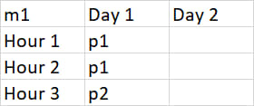
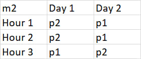
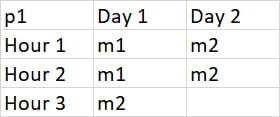
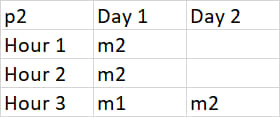

This was done as an application for my diploma.

# Timetable Scheduling Application

This repository contains a C# application for generating and managing a timetable schedule with exporting results to Excel. Includes classes for handling groups, professors.
This was a proof of concept for using knap-sack problem with schedule building.

## Table of Contents

- [Technologies Used](#technologies-used)
- [Architecture Overview](#architecture-overview)
- [TimetableTask Algorithm](#timetabletask-algorithm)
- [Data Input](#data-input)
- [Program Output](#program-output)
- [Installation](#installation)
- [Usage](#usage)
- [License](#license)

## Technologies Used

- **MathNet.Numerics**: Library for mathematical computations.
- **xUnit**: Framework for unit testing.
- **NPOI**: Library for exporting results to Excel.

## Architecture Overview

The application consists of several key classes:

1. **TimetableTask**: Partial class handling schedule building and validation.
2. **TimetableTask.Builder**: Partial class for building and verifying initial state of `TimetableTask` instances using a fluid interface builder pattern.
3. **ExcelExport**: Exporting results to Excel files.
4. **Group**: Stores data and availability vectors for groups.
5. **Professor**: Similar to `Group`, for professors.
6. **ProfGroup**: A shorthand to build task parameters easier.
7. **Item**: Converts abstract lectures into items with weight, value, and references.
8. **KnapSackProblem**: Static class for solving the knapsack problem.

## TimetableTask Algorithm

### Method: Solve

The `Solve` method initializes the process:

- Sets up original availabilities.
- Iterates over each professor to solve their scheduling problem.
- Wraps up each iteration to check conditions and update availabilities.
- Exports the schedule to an .xlsx file and verifies the solution.

### Method: SolveByProfessor

The `SolveByProfessor` method provides iteration-able support for building the timetable:

- Prepares the schedule for a professor by creating items and solving the knapsack problem.
- Assigns items to available hours.
- Updates availabilities and records the schedule in the solution matrix.

**Core Algorithm**:

- Sort items by value with knapsack algorithm.
- Assign items to the first common available hour.
- Update availability and record the schedule.

### Example Code for Preparing Data

#### Adding Professors

```csharp
// Example 1
var professors = new List<Professor> {
    new Professor("p1") { Availability = Vector<float>.Build.Dense(hours * days, 1)},
    new Professor("p2") { Availability = Vector<float>.Build.Dense(hours * days, 1)},
};
var task = new TimetableTask.Builder().Professors(professors);

// basically
var professors = new List<Professor>();
professors.Add(new Professor(professor));
var task = new TimetableTask.Builder().Professors(professors);
```

#### Groups

```csharp
var groups = new List<Group> {
    new Group("Group1") { Availability = Vector<float>.Build.Dense(hours * days, 1)},
    new Group("Group2") { Availability = Vector<float>.Build.Dense(hours * days, 1)},
};
var task = new TimetableTask.Builder().Groups(groups);
```

#### Planned Hours Matrix

```csharp
// Example using List<ProfGroup>
var plannedHoursList = new List<ProfGroup> {
    new ProfGroup(professor1, group1, 3),
    new ProfGroup(professor2, group2, 4)
};
var task = new TimetableTask.Builder().PlannedHours(plannedHoursList);

// Example using matrix
var plannedHoursMatrix = Matrix<float>.Build.DenseOfArray(new float[,] {
    { 3, 0, 0 },
    { 0, 4, 0 },
    { 0, 0, 2 }
});
var task = new TimetableTask.Builder().PlannedHours(plannedHoursMatrix);
```

#### Fully set up task

```csharp
var task = TimetableTask.Builder()
    .Days(days) // Number of days
    .HoursPerDay(hours) // Max hours per day
    .Professors(professors)
    .Groups(groups)
    .PlannedHours(plannedHoursMatrix);

task.Solve();
```

## Program Output

The program outputs the solution matrix at each stage and the final .xlsx file with the resolved timetable. Users can review the results through console outputs and Excel sheets.

### Example of Program Output

#### Console Output

```
Timetable limitations created successfully.
DenseMatrix 2x2-Single
2  1
3  3

Weights:
DenseMatrix 2x2-Single
4  1
3  2

DenseMatrix 6x4-Single
1  0  0  0
1  0  0  0
0  0  1  0
0  0  1  0
0  0  1  0
0  0  0  0

DenseMatrix 6x4-Single
1  0  0  1
1  0  0  1
0  1  1  0
0  0  1  0
0  0  1  0
0  0  0  1
```

#### Excel Sheets

Groups:




Profs:




An example with real data

.jpg>)
.jpg>)

## Installation

1. Clone the repository:
   ```sh
   git clone https://github.com/yourusername/timetable-scheduling-app.git
   ```
2. Navigate to the project directory:

   ```sh
   cd timetable-scheduling-app


   ```

3. Restore dependencies:
   ```sh
   dotnet restore
   ```

## Usage

1. Build the project:
   ```sh
   dotnet build
   ```
2. Run the tests:
   ```sh
   dotnet test
   ```
3. Run the application:
   ```sh
   dotnet run
   ```

To run the tests `dotnet test`

## License

Use it however you want.
